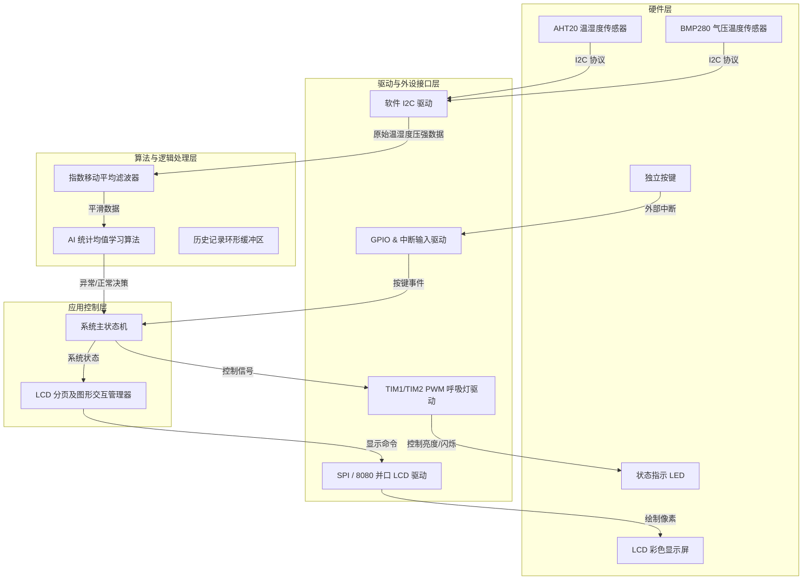
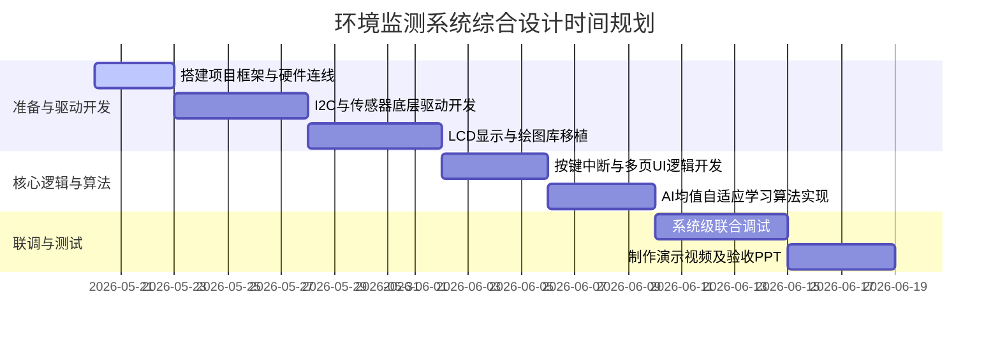

# 环境温度监测系统综合设计报告 (System Design Report)

本报告针对中山大学《微机原理与嵌入式系统实验》的“环境温度监测系统”综合设计实验进行详细方案设计。

系统基于 **STM32F103C8T6** 开发板（配合实验箱），融合了 **I2C 多传感器采集（AHT20 温湿度 + BMP280 气压温度）** 与 **轻量级片上 AI 统计学习算法**，实现了智能化的环境实时监测、状态反馈及异常警报。

---

## 1. 系统总体架构与设计思路

系统采用模块化分层设计，主要由**硬件层 (Hardware Layer)**、**驱动与外设接口层 (Driver Layer)**、**算法与逻辑处理层 (Algorithm Layer)** 和 **应用控制层 (Application Layer)** 组成。

### 1.1 系统框图


---

## 2. 硬件接口与引脚分配

针对 EES351-MC 实验箱的 STM32 板载与面包板扩展资源，我们进行了标准化的引脚规划：

| 外设模块 | 引脚名称 | STM32 管脚 | 接口模式 | 功能描述 |
| :--- | :--- | :--- | :--- | :--- |
| **I2C 传感器** | SCL | `PA6` | 模拟开漏输出 | AHT20/BMP280/BH1750 共享 SCL 时钟线 |
| (AHT20/BMP280/BH1750) | SDA | `PB10` | 模拟开漏输出 | AHT20/BMP280/BH1750 共享 SDA 数据线 |
| **TFT-LCD** | SCL/CLK | `PA5` | SPI 时钟 | LCD 串行时钟线 |
| | SDA/MOSI| `PA7` | SPI 主出从入 | LCD 数据传输线 (MOSI) |
| **TFT-LCD 辅助** | CS | `PA4` | GPIO 输出 | LCD 片选信号 (低电平有效) |
| | RS/DC | `PA8` | GPIO 输出 | 数据/命令选择引脚 (0=命令, 1=数据) |
| | RST | `PA3` | GPIO 输出 | LCD 复位引脚 |
| | BL / LED| `PB1` | PWM 输出 | 屏幕背光亮度控制 |
| **状态 LED** | RED | `PA0` | TIM2_CH1 PWM | 红色 LED 状态指示（故障/异常/警报） |
| | YELLOW | `PA1` | TIM2_CH2 PWM | 黄色 LED 状态指示（AI学习/防盗预警） |
| | GREEN | `PA2` | TIM2_CH3 PWM | 绿色 LED 状态指示（安全监控，带呼吸） |
| **独立按键** | KEY1 | `PB0` | GPIO 输入 | 翻页切换键 |
| | KEY2 | `PB8` | GPIO 输入 | 主题切换与重置键 |
| | KEY3 | `PB9` | GPIO 输入 | 外接防盗布防/撤防警戒开关 |

---

## 3. 算法层设计：AI 学习智能监测 (核心特色)

本设计实现了**扩展要求3（AI 智能监测）**，通过引入无监督统计学习机制，使得系统能够在特定的安装环境中“自适应学习”基准温度。

### 3.1 学习与检测数学模型
1. **平滑滤波 (Preprocessing)**:
   使用指数移动平均 (EMA) 算法滤除高频噪声：
   $$T_f[n] = \alpha \cdot T_{raw}[n] + (1 - \alpha) \cdot T_f[n-1]$$
   *(取 $\alpha = 0.2$，有效消除传感器瞬时波动)*

2. **学习阶段 (Learning Phase)**:
   系统在上电前 $M$ 次采集（例如前 150 秒或 100 次采样）进入“自适应学习模式”。在此期间，系统只记录数据并动态更新历史均值（Baseline Mean）：
   $$\mu_{base}[n] = \frac{n-1}{n}\mu_{base}[n-1] + \frac{1}{n}T_f[n]$$
   此时黄色 LED (PA1) 保持常亮以示学习状态。

3. **智能监控阶段 (Monitoring Phase)**:
   学习期结束后，锁定历史基准均值 $\mu_{base}$。此后，每次采集新值 $T_f$，计算其与基准的偏差：
   $$\Delta T = |T_f - \mu_{base}|$$
   - 若 $\Delta T \le 5^\circ\text{C}$，判定为 **正常 (NORMAL)**。此时**绿色 LED (PA2) 开启平滑呼吸渐变效果**（以低功耗且直观的呼吸动效指示系统处于安全守护状态）。
   - 若 $\Delta T > 5^\circ\text{C}$，判定为 **异常 (ANOMALY)**。此时状态机强制关闭绿灯呼吸，切换为**红色 LED (PA0) 进行高频闪烁 (5Hz)** 警报。

### 3.2 历史查询与异常日志 (Ring Buffer)
设计一个固定大小的环形缓冲区（`AnomalyLog`），当发生温度异常触发时，记录当前的 `时间戳(系统运行时间)、基准温度、当前温度、当前气压`。用户可通过 KEY1 翻页，在 LCD 上查询最近 5 次的异常报警历史。

---

## 4. 软件模块划分与 API 设计

### 4.1 驱动层接口 (`Hardware/`)

* **`led.h / led.c`**
  ```c
  void LED_Init(void);
  void LED_SetBreathing(uint8_t enable); // 开启/关闭 PWM 呼吸灯 (定时器配置)
  void LED_SetFlashing(uint8_t enable);  // 开启/关闭高频闪烁
  ```
* **`key.h / key.c`**
  ```c
  void KEY_Init(void);
  uint8_t KEY_GetState(void);            // 获取按键按下状态（支持软件消抖）
  ```
* **`i2c.h / i2c.c`** (软件模拟 I2C)
  ```c
  void I2C_Start(void);
  void I2C_Stop(void);
  void I2C_WriteByte(uint8_t byte);
  uint8_t I2C_ReadByte(uint8_t ack);
  ```
* **`aht20.h / aht20.c`**
  ```c
  uint8_t AHT20_Init(void);
  uint8_t AHT20_ReadData(float *temp, float *humidity);
  ```
* **`bmp280.h / bmp280.c`**
  ```c
  uint8_t BMP280_Init(void);
  uint8_t BMP280_ReadData(float *temp, float *pressure);
  ```
* **`lcd.h / lcd.c`**
  ```c
  void LCD_Init(void);
  void LCD_Clear(uint16_t color);
  void LCD_ShowString(uint16_t x, uint16_t y, char *str, uint16_t color);
  void LCD_DrawLine(uint16_t x1, uint16_t y1, uint16_t x2, uint16_t y2, uint16_t color);
  ```

### 4.2 应用逻辑与界面调度层 (`User/`)

* **`main.c`**：主循环逻辑、定时采样调度与系统状态转移。
* **`ui_manager.c`**：实现分页逻辑。
  - **第 1 页 (Real-time View)**：显示当前平滑后的温度、湿度、大气压、组号以及系统当前所处状态（学习中/正常/异常）。
  - **第 2 页 (AI Analysis View)**：显示学习周期进度、历史基准值 $\mu_{base}$、偏差曲线（用简易折线图在 LCD 底部绘制）。
  - **第 3 页 (Log History View)**：显示环形缓冲区中记录的异常触发事件日志。

---

## 5. 项目时间规划与验收准备

为确保第 17 周顺利完成验收，项目执行规划如下：



### 5.1 现场验收展示重点
1. **呼吸灯过渡到闪烁**：现场手部温热传感器，使温度迅速升温偏离历史基准 5°C 以上。此时可观察到原本进行平滑呼吸渐变的**绿色 LED (PA2) 瞬间熄灭**，代表异常警报的**红色 LED (PA0) 立刻以 5Hz 频率高速闪烁**，同时 LCD 顶部弹出明显的红底白字 “ANOMALY ALARM”。整个过程蜂鸣器保持静音，微信收到温度突变警报推送，展示了高度的人性化和智能化设计。
2. **多传感器与多页显示**：按下 KEY1 键切换至第 2 页，展示温度和大气压的实时偏差折线图。
3. **日志与数据查询**：进入第 3 页，展示前几次异常触发的瞬时快照数据。
